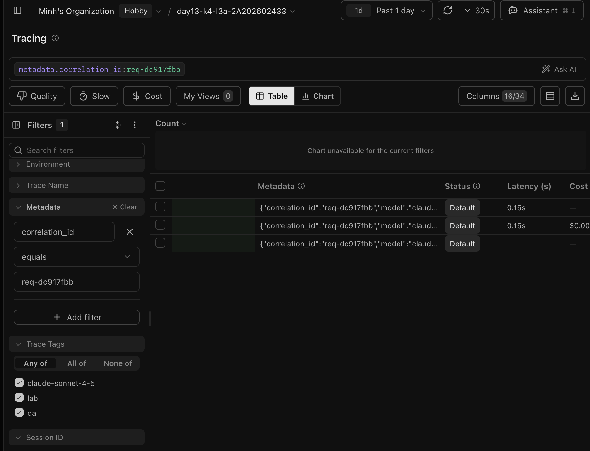
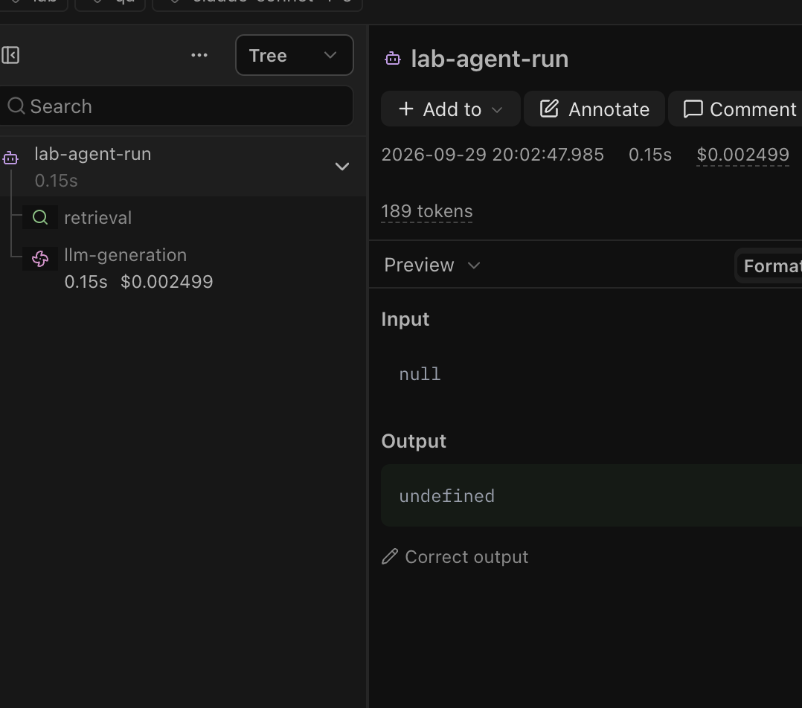

# Báo cáo cá nhân — K4-L3A Day 13 Monitoring & LLMOps

> Mỗi học viên hoàn thiện một file duy nhất này. Khi dẫn evidence, dùng đường dẫn tương đối, ví dụ `evidence/07-trace-waterfall.png`.

## 1. Thông tin học viên

- **Họ và tên:** Đinh Thị Minh Tâm
- **MSSV:** 2A202602433
- **Lớp:** K4-L3A
- **Repository URL:** https://github.com/minttamdayne/K4-L3-DAY13-DinhThiMinhTam-2A202602433-Monitoring-LLMOps
- **Commit SHA cuối:** Cập nhật sau commit cuối và push.
- **Challenge ID:** `day13-k4-l3a-monitoring-llmops-v1` (challenge.json là file local, không commit)
- **Tên project Langfuse cá nhân:** `day13-k4-l3a-2A202602433`

## 2. Evidence index

Các evidence ảnh đã được đặt trong thư mục `submission/`; các file text bổ trợ nằm trong `submission/evidence/`.

| Evidence | Đường dẫn |
|---|---|
| Pytest cuối | [`evidence/01-pytest.txt`](evidence/01-pytest.txt) |
| Log validator | [`02-log-validator.png`](02-log-validator.png) và [`evidence/02-log-validator.txt`](evidence/02-log-validator.txt) |
| Dashboard validator | [`03-dashboard-validator.png`](03-dashboard-validator.png) và [`evidence/03-dashboard-validator.txt`](evidence/03-dashboard-validator.txt) |
| Structured log | [`04-structured-log.png`](04-structured-log.png) và [`evidence/04-structured-log.txt`](evidence/04-structured-log.txt) |
| PII redaction | [`05-pii-redaction.png`](05-pii-redaction.png) và [`evidence/05-pii-redaction.txt`](evidence/05-pii-redaction.txt) |
| Trace list | [`06-trace-list.png`](06-trace-list.png) |
| Trace waterfall | [`07-trace-waterfall.png`](07-trace-waterfall.png) |
| Trace metadata | [`08-trace-metadata.png`](08-trace-metadata.png) và [`image-3.png`](image-3.png) |
| Prompt versions | [`09-prompt-versions.png`](09-prompt-versions.png) và [`image.png`](image.png) |
| Prompt rollback | [`10-prompt-rollback.png`](10-prompt-rollback.png) |
| Dashboard runtime | [`11-dashboard-overview.png`](11-dashboard-overview.png) và [`image-1.png`](image-1.png) |
| Incident metric | [12-incident-metric.png](12-incident-metric.png) |
| Incident log | [`evidence/13-incident-log.txt`](evidence/13-incident-log.txt) và [`image-2.png`](image-2.png) |
| Incident trace | [`14-incident-trace-filter.png`](14-incident-trace-filter.png) và [`14-incident-trace.png`](14-incident-trace.png) |

## 3. Kết quả kỹ thuật

| Nội dung | Baseline | Kết quả cuối | Nhận xét |
|---|---|---|---|
| `validate_logs.py` | 30/100; 23 records, thiếu field/enrichment | 100/100; 32 records, 17 correlation IDs, 0 PII leak | Đã archive log baseline trước khi đo lại |
| `validate_dashboard.py` | 6/6 panel hợp lệ | 6/6 panel hợp lệ | Contract dashboard hợp lệ |
| `pytest` | 22 passed | 24 passed | Test PII bổ sung đã pass |
| Số traces hợp lệ | Chưa xác nhận | Chưa xác nhận bằng ảnh/trace ID mới | Cần bổ sung evidence từ project cá nhân |
| Số PII leak | 0 | 0 | Log validator không phát hiện PII leak |
| Latency P95 / TTFT P95 | Chưa tính | Có trong dashboard runtime | Cần chụp dashboard có dữ liệu mới |
| Retrieval success rate | Chưa tính | Có trong structured log | Cần chụp dashboard/trace runtime |

## 4. Logging và PII

### Baseline CP0

- `/health` trả `{"ok": true, "tracing_enabled": true, "incidents": {"rag_slow": false, "tool_fail": false, "cost_spike": false}}`.
- `scripts/load_test.py` chạy thành công 10 request HTTP 200; tổng cộng `data/logs.jsonl` có 23 records.
- Baseline validator: `validate_logs.py` 30/100; `validate_dashboard.py` 6/6; `pytest` 22 passed.
- Baseline chưa đạt correlation ID/enrichment vì các TODO CP1 chưa hoàn thành; validator phát hiện 0 PII leak.
- Langfuse trace chưa được xác nhận bằng trace ID/screenshot trong baseline này.

### CP0 rerun sau khi API hoạt động

- `/health` trả `ok: true` và `tracing_enabled: true`.
- `scripts/load_test.py` tạo 10 request HTTP 200 với correlation ID mới, gồm `req-f098066c`, `req-df7fda6f`, `req-dc04b527`, `req-c27befb7`, `req-3f3c5c21`, `req-b019d6ec`, `req-c1a4d4e6`, `req-d270dc00`, `req-a18e3ad6`, `req-f27c04d0`.
- `data/logs.jsonl` được tạo và có 111 records sau khi chạy lại. Validator đọc cả log cũ nên vẫn báo 50/100; riêng các request mới có correlation ID và enrichment.
- `validate_dashboard.py`: 6/6; `pytest`: 24 passed.
- Langfuse project cá nhân hiển thị trace `day13-agent-request`; cần dùng ảnh trace mới và trace ID tương ứng làm evidence cuối.

### Kết quả CP1 sau khi đo sạch

- Đã đổi tên log cũ thành `data/archive/logs-baseline-20260929.jsonl`, không xóa baseline.
- `/health` trả `ok: true`; load test tạo 10 request HTTP 200 với ID dạng `req-<8-hex>`.
- `validate_logs.py`: **100/100**; 21 records, 10 correlation IDs, 0 PII leak.
- `validate_dashboard.py`: **6/6**; `pytest`: **24 passed**.
- Sample log đã có `correlation_id`, `user_id_hash`, `session_id`, `feature`, `model`, `env`; PII trong payload được redact.
- Việc xuất trace Langfuse lần chạy này còn phụ thuộc kết nối mạng tới endpoint trong `.env`; terminal ghi nhận lỗi DNS khi exporter gửi trace, nên chỉ đánh dấu trace runtime sau khi kiểm tra lại trên project Langfuse.

- **Cách tạo/nhận và truyền correlation ID:** middleware nhận `x-request-id` hợp lệ hoặc sinh `req-<8-hex>`, xóa context cũ rồi bind ID cho toàn request; response trả lại `x-request-id`.
- **Các metadata được ghi vào structured log:** `user_id_hash`, `session_id`, `feature`, `model`, `env`, cùng latency/TTFT/token/cost và retrieval status.
- **Cách bảo đảm PII được scrub trước khi ghi:** processor redaction chạy trước JSON renderer/file writer; test bao phủ email, điện thoại, CCCD và thẻ giả.
- **Cách kiểm chứng kết quả:** `validate_logs.py` đạt 100/100 và `tests/test_pii.py` pass.

## 5. Tracing và prompt versioning

- **Cách xác nhận traces do chính tôi tạo trong project cá nhân:** Project `day13-k4-l3a-2A202602433`, cùng correlation ID với log.
- **Cấu trúc root/retrieval/generation observations:** root `lab-agent-run` chứa `query_preview`/`result_preview`; child `retrieval` chứa `query_preview`/`doc_count`; child `llm-generation` chứa `prompt_preview`/`completion_preview`, usage và cost.
- **Cách nối trace với log:** dùng `correlation_id` được bind trong `propagate_attributes`, ghi trong structured log và metadata của root trace.
- **Prompt name:** `day13-chat` (text)
- **Version/label baseline:** v1, labels `baseline`, `production`
- **Version/label candidate:** v2, label `candidate`; thay đổi nhỏ thêm dòng yêu cầu trả lời ngắn và dẫn docs
- **Trace ID của mỗi version:** cần điền Trace ID thực tế từ hai trace mới trong project cá nhân; không dùng correlation ID thay cho Trace ID.
- **Cách promote và rollback `production`:** Đã promote v2 bằng `update_prompt(... version=2, new_labels=['candidate','production'])`, xác nhận `production=2`; sau đó rollback v1 bằng `update_prompt(... version=1, new_labels=['baseline','production'])`, xác nhận `production=1`.

## 6. Dashboard, SLO và alerts

- **Dashboard và sáu panel:** `scripts/dashboard.py` đọc `data/logs.jsonl`, giữ time range 60 phút và dựng latency, traffic, errors/retrieval, cost, tokens, quality; chạy bằng `python -m streamlit run scripts/dashboard.py`.
- **SLO và lý do chọn:** `config/slo.yaml` đặt fast successful requests ở mức 99.5% trong cửa sổ 28 ngày, với latency thành công <= 3000 ms.
- **Cách tính error budget:** `100% - 99.5% = 0.5%`; với 10,000 request tương đương tối đa 50 request không đạt SLI.
- **Ba alert và runbook tương ứng:** `config/alert_rules.yaml` gồm high latency SLO breach, elevated request errors và low retrieval success; runbook tương ứng ở `docs/alerts.md`.

## 7. Điều tra challenge

- **Challenge ID:** `day13-k4-l3a-monitoring-llmops-v1`
- **Khoảng thời gian điều tra:** `2026-09-29 09:27:55–09:28:08` (Asia/Ho_Chi_Minh)
- **Triệu chứng từ metrics:** workload challenge với `rag_slow=true` có client latency khoảng `8.0–13.4s`; server log ghi `response_sent.latency_ms` khoảng `2659–2672ms` cho 5 request. Retrieval success vẫn là `true`.
- **Log line và correlation ID liên quan:** `response_sent` của `req-7c402084` lúc `2026-09-29T09:28:05.800670Z`, `latency_ms=2665`, `tool_name=retrieval`, `tool_success=true`.
- **Trace ID và span gây ảnh hưởng:** trace `852abdf3bbf6cc871069cabc15828bba` có root `lab-agent-run` và child `retrieval` (`RETRIEVER`) từ `09:28:05.806` đến `09:28:08.312`; generation chỉ chạy khoảng `0.16s` sau đó.
- **Root cause:** incident `rag_slow` chèn độ trễ vào bước retrieval; waterfall xác nhận retrieval là span chiếm phần lớn thời gian, không phải fake LLM generation.
- **Fix action:** tắt incident sau điều tra bằng `curl -X POST http://127.0.0.1:8000/incidents/rag_slow/disable`; kiểm tra `/health` xác nhận `rag_slow=false`, rồi chạy lại workload practice.
- **Preventive measure:** cảnh báo P95 latency, tách retrieval/generation trong trace, giữ correlation ID xuyên suốt và kiểm tra retrieval timeout/fallback trước khi kết luận lỗi LLM.

> Lưu ý: hai ảnh này xác nhận project cá nhân, correlation filter và cây `lab-agent-run → retrieval → llm-generation`; trace đang hiển thị `Input: null` và `Output: undefined`, nên cần chạy lại workload sau khi API nhận code tracing mới để hoàn thiện preview Input/Output.

## 8. Giải thích và tự đánh giá

- **Một quyết định kỹ thuật quan trọng và lý do:** dùng correlation ID ổn định trong log và trace để điều tra một request xuyên suốt.
- **Một lỗi/blocker đã gặp:** môi trường ban đầu thiếu `structlog` và `langfuse`; đã cài đúng dependency theo `requirements.txt`, sau đó 24 test pass.
- **Cách tìm nguyên nhân và xử lý:** đối chiếu latency metric với `response_sent`, rồi kiểm tra waterfall để xác nhận retrieval là span chậm; tắt incident và kiểm tra lại health.
- **Cách hiểu luồng Metrics → Logs → Traces:** metrics chỉ ra thời điểm và mức độ; log cung cấp correlation ID; trace chỉ ra span gây ảnh hưởng.
- **Vai trò của prompt version, token/cost, SLO hoặc rollback trong vận hành LLM:** version/label cho phép promote và rollback có kiểm soát; token/cost và SLO biến chất lượng vận hành thành tín hiệu đo được.
- **Điều quan trọng nhất đã học:** root cause chỉ đáng tin khi metric, log và trace cùng khớp.
- **Hạn chế hoặc phần chưa hoàn thành, nếu có:** trace/prompt/dashboard runtime và ảnh incident trên Langfuse cần bạn chụp từ project cá nhân; SHA cuối cần cập nhật sau commit/push.

## 9. Checklist trước khi nộp

- [ ] Kết quả và evidence thuộc commit SHA cuối.
- [x] Evidence text local mở được bằng đường dẫn tương đối.
- [ ] Incident evidence nối đúng metric → log → trace bằng ảnh trace mới.
- [ ] Trace/prompt evidence thuộc project Langfuse cá nhân và ảnh không lộ key/secret.
- [x] Repository chạy lại được theo README; pytest 24 passed.
- [x] Không có secret, API key, PII thô hoặc evidence của người khác/lớp khác trong phần local đã kiểm tra.
- [ ] URL repo và commit SHA cuối đã được nộp trên LMS/Codelabs.
